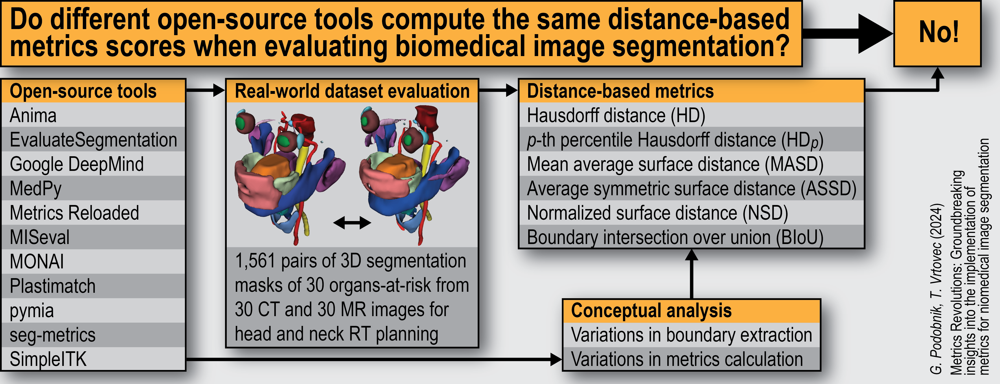

# MeshMetrics
> Official Python-based implementation of `MeshMetrics` from [_Metrics Revolutions: Groundbreaking Insights into the Implementation of Metrics for Biomedical Image Segmentation_](https://arxiv.org/abs/2410.02630).

## About
`MeshMetrics` provides a precise, mesh-based implementation of critical metrics used in the evaluation of image segmentation tasks. Quantitative performance metrics are fundamental for objective and reproducible segmentation assessments. Although *overlap-based* metrics - such as **Dice similarity coefficient** (DSC) and **intersection over union** (IoU) - are relatively straightforward to compute, *distance-based* metrics often lack uniform implementation across tools due to the complexity of distance calculations.

`MeshMetrics` includes accurate implementations of key distance-based metrics:
- **Hausdorff Distance** (HD) with $p$-th **percentile variants** (HD<sub>p</sub>)
- **Mean Average Surface Distance** (MASD)
- **Average Symmetric Surface Distance** (ASSD)
- **Normalized Surface Distance** (NSD)
- **Boundary Intersection over Union** (BIoU)

`MeshMetrics` provides 2D and 3D implementations of distance-based metrics and supports computing metrics using different segmentation representations (`numpy.ndarray`, `SimpleITK.Image`, and `vtk.vtkPolyData`). Additionally, it allows for flexibility in representation between reference and predicted segmentations - one input can be a mask image (`SimpleITK.Image`), while the other can be a surface mesh (`vtk.vtkPolyData`). For more details, refer to the *Advanced usage* section in [`examples.ipynb`](examples.ipynb).

By leveraging mesh representations of segmentation masks, `MeshMetrics` ensures precision in distance and boundary element size calculations. For further details and comparisons with other open-source tools supporting distance-based metric calculations, please refer to [our paper](https://arxiv.org/abs/2410.02630).



If you use `MeshMetrics` in your work, please cite:
```
Podobnik, G., & Vrtovec, T. (2024). Metrics Revolutions: Groundbreaking Insights into the Implementation of Metrics for Biomedical Image Segmentation. arXiv preprint arXiv:2410.02630.
```

## Installation
### System Dependencies
This package requires `libxrender1` to be installed on your system. Install it via:
```bash
sudo apt update && sudo apt install -y libxrender1
```

### Install `MeshMetrics` package
First, clone the repository and install the required dependencies along with the `MeshMetrics` package using pip:
```bash
$ git clone https://github.com/gasperpodobnik/MeshMetrics.git
$ pip install MeshMetrics/
```

## Usage
Simple usage example of `MeshMetrics` for 3D segmentation masks is shown below.
See [`examples.ipynb`](examples.ipynb) notebook for more examples.

```python
from pathlib import Path
import SimpleITK as sitk
from MeshMetrics import DistanceMetrics

data_dir = Path("data")
# initialize DistanceMetrics object
dist_metrics = DistanceMetrics()

# read binary segmentation masks
ref_sitk = sitk.ReadImage(data_dir / "example_3d_ref_mask.nii.gz")
pred_sitk = sitk.ReadImage(data_dir / "example_3d_pred_mask.nii.gz")

# set input masks and spacing (only needed if both inputs are numpy arrays or vtk meshes)
dist_metrics.set_input(ref=ref_sitk, pred=pred_sitk)

# Hausdorff Distance (HD), by default, HD percentile is set to 100 (equivalent to HD)
hd100 = dist_metrics.hd()
# 95th percentile HD
hd95 = dist_metrics.hd(percentile=95)
# Mean Average Surface Distance (MASD)
masd = dist_metrics.masd()
# Average Symmetric Surface Distance (ASSD)
assd = dist_metrics.assd()
# Normalized Surface Distance (NSD) with tau=2
nsd2 = dist_metrics.nsd(tau=2)
# Boundary Intersection over Union (BIoU) with tau=2
biou2 = dist_metrics.biou(tau=2)

# ----------------------------------------
# If using `numpy.ndarray` representations, please note that the spacing must be
# reordered when converting a `SimpleITK.Image` object to a `numpy.ndarray`
ref_np = sitk.GetArrayFromImage(ref_sitk).astype(bool)
pred_np = sitk.GetArrayFromImage(pred_sitk).astype(bool)

# spacing should resemble the order of numpy array axes
spacing = ref_np.GetSpacing()[::-1]

dist_metrics = DistanceMetrics()
dist_metrics.set_input(ref=ref_np, pred=pred_np, spacing=spacing)
# ... follow the same procedure as before
```
